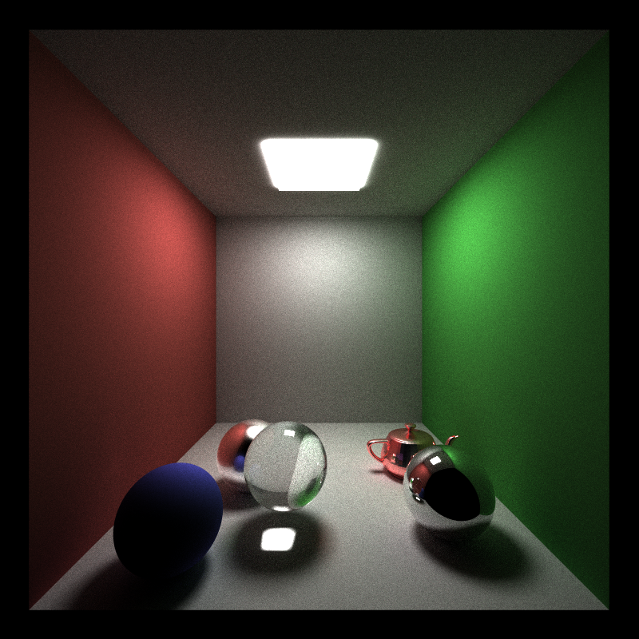
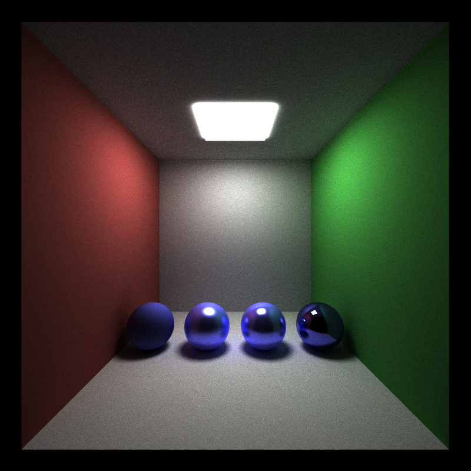
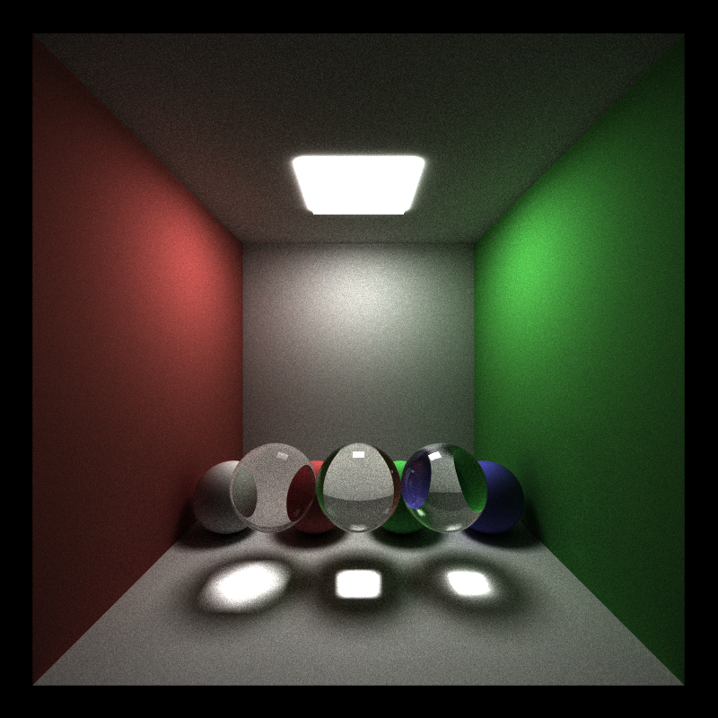
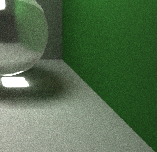
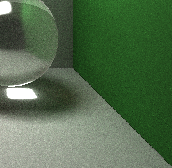
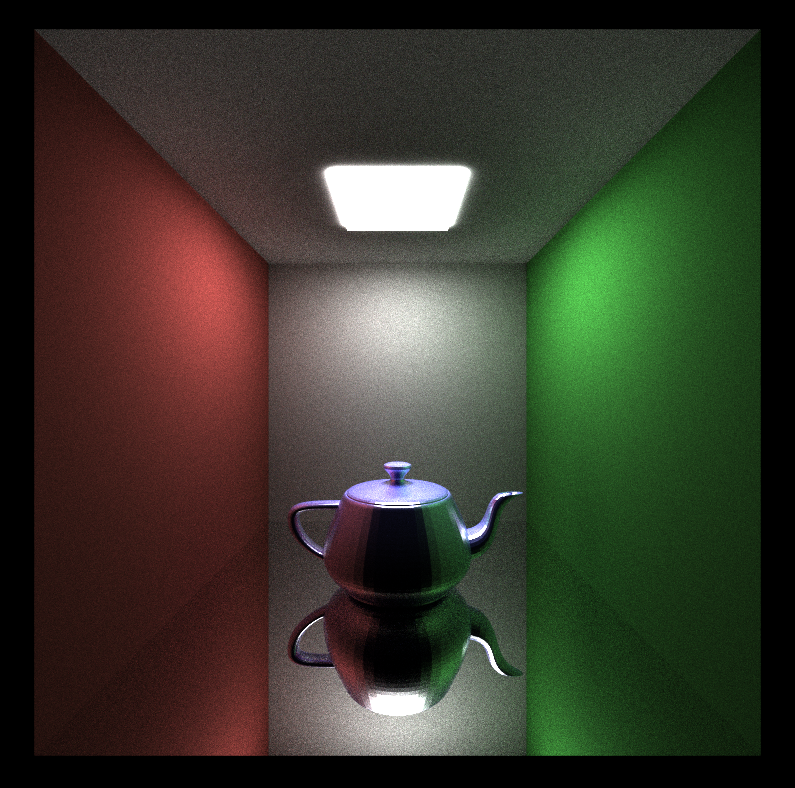
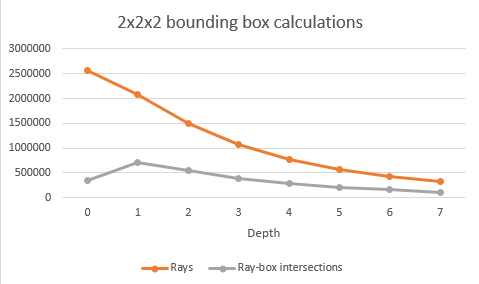
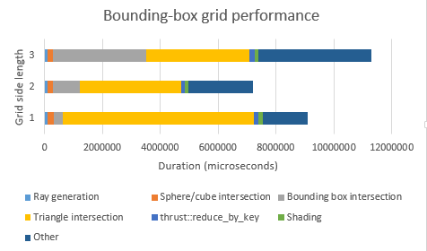
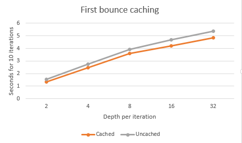

CUDA Path Tracer
================

**University of Pennsylvania, CIS 565: GPU Programming and Architecture, Project 3**

* Name: Zhan Xiong Chin
* Tested on: Windows 7 Professional, Intel(R) Xeon(R) CPU E5-1630 v4 @ 3.70 GHz 3.70 GHz, GTX 1070 8192MB (SIG Lab)

Overview
========

5000 iterations, ~1h rendering time

GPU-based path tracer. Renders by casting rays from the camera and bouncing them around the scene until they hit a light. This path-tracer implements the core features:

* Path compaction of out-of-scene rays
* First bounce caching
* Compaction of same-material rays
* Diffuse and perfect specular (mirrored) materials

Furthermore, this path-tracer implements the following additional features:

* Refractive materials
	* Includes Fresnel effects using Schlick's approximation
* Imperfect specular materials
* Stochastic sampling for anti-aliasing
* Model loading from .OBJ files
	* Also includes automatic partitioning of model into sub-models

Build Instructions
==================
[See here](https://github.com/CIS565-Fall-2016/Project0-CUDA-Getting-Started/blob/master/INSTRUCTION.md)

Diffuse and specular materials
==============================
Each time a ray hits an object, it has a 50-50 chance of either doing a diffuse bounce or a specular bounce. A diffuse bounce is chosen from a hemisphere normal to the plane of intersection using a cosine-weighted function. On the other hand, a specular bounce uses the formulas from [*GPU Gems 3*, Chapter 20](http://http.developer.nvidia.com/GPUGems3/gpugems3_ch20.html) to generate a random specular ray. With increasing specular exponent, the potential range of the specular bounce gets narrower, forming a sharper reflective image. 

From left to right: diffuse, specular exponent 25, specular exponent 100, perfectly reflective

It may be possible to achieve some additional speed-up in convergence of the image by tweaking the bounce probability. In particular, a material with a higher specular exponent may be able to render correctly with a smaller proportion of specular bounces, since the variance in angle of the reflected ray is smaller.

Refraction
==========
Refractive objects do not make use of diffuse bounces. Instead, the exact reflection or refraction of the ray is calculated. [Schlick's approximation](https://en.wikipedia.org/wiki/Schlick%27s_approximation) is used to calculate Fresnel effects.

Refractive indices from left to right: 1.2, 1.6, 2.4.

As compared to a CPU, refraction may impact performance on the GPU slightly, as having a refractive material causes additional branching to occur in the shader kernel. In principle, it might be possible to optimize this by groupin rays of the same material together (see below), though in practice this is not likely to be the case.

Anti-aliasing
=============
Stochastic sampling is used for anti-aliasing. In other words, each pixel is split up into some number of subpixels, and the color is taken as an average of random rays from each subpixel.

Below, the image on the left is anti-aliased (4 sub-pixels per pixel, 5000 iterations), whereas the image on the right is not anti-aliased (20000 iterations). The effect of anti-aliasing can be clearly seen on the borders of the sphere as well as the base of the wall.

 

If the number of iterations is scaled correspondingly (e.g. as above), anti-aliasing can result in slightly higher performance, as there need to be less kernel launches and more ray intersections can be calculated in parallel. From experimentation, the anti-aliased image seems to take approximately 5-10% faster to render than the non-anti-aliased one.

 However, this does not work together with first-bounce caching, since the first bounce is no longer deterministic. Thus, the overall impact on performance is likely to end up the same. If non-stochastic anti-aliasing were used instead (e.g. using the same ray for each sub-pixel), we could still preserve the benefits of both. This is also a feature that scales well on the GPU, since increasing the number of rays parallelizes better than on a CPU.

Model loading and rendering
===========================
[tinyObjLoader](http://syoyo.github.io/tinyobjloader/) was used for model loading.

For testing, the Utah teapot model was used (~22000 triangles). Due to the large number of triangle-ray intersections required, performance slowed down significantly. Two methods were used to improve performance. 

Firstly, box-ray intersections are performed by first intersecting each ray with each model's bounding box in parallel, then compacting the pairs which collide. Then, for each box-ray intersection, a kernel loops through all triangles in the model and calculates the nearest intersection. This significantly reduces the number of ray-model intersections that need to be computed.

Secondly, the model loader also automatically partitions a model into a n^3 grid of submodels by bounding box, to reduce the number of collisions needed. A 2-by-2-by-2 grid seems to give the best speed-up for the teapot model used for testing; it balances the increase in bounding-box intersection time against the speedup in triangle intersection time the best.

The above graph is a breakdown of time spent in each kernel for 1x1x1, 2x2x2, and 3x3x3 grids, for the scene at the very beginning of the readme. In particular, note that the most time is spent on triangle intersection and bounding box intersection. Increasing the grid side length from 1 to 2 improves performance by decreasing the time spent on triangle intersections, but it would appear that after this point the benefits no longer accrue. On the other hand, the time taken for bounding box intersection increases in a cubic fashion, as expected from the implementation. 

The GPU version is much faster than the CPU version, since ray-triangle or ray-box intersections are embarrassingly parallel. However, one speed-up that would likely improve performance significantly is the construction of an octree over the model or scene (rather than just a single-layered n^3 grid). Alternatively, it could be possible to continue using the single-layered grid, but perform iterative traversal rather than intersecting all n^3 grid cells against a ray. It is possible to calculate both the initial grid cell the ray hits, as well as the next grid cell it would go to, iteratively without significant branching. 

While both of the above speed-ups are much harder to implement on the GPU as compared to the CPU, they would allow the time needed for bounding box intersection to scale linearly rather than cubically, while decreasing triangle intersection time for complex models. Since most of the time is spent in these two kernels, performance would improve significantly if either one is successfully implemented.

Path compaction
===============
Path compaction achieves a significant speed-up, especially when there are a large number of polygons in a scene. As can be seen from the graph in the previous section, the number of rays drops significantly as the depth decreases. This has a major impact on performance for open scenes (i.e. scenes where rays can escape), but would not be seen for closed scenes (e.g. a closed room).

First-bounce caching
====================
For the non anti-aliased implementation, the first bounce of the ray can be cached, as it is deterministic. This improves performance significantly in complex scenes.

For example, the teapot model above was rendered with and without first bounce caching over a number of depths. Caching consistently improved the performance of the rendering by 10%. This is because the initial bounce calculation is the most expensive, having the largest number of rays to intersect. 

Grouping by material
====================
It is also possible to group rays that intersect the same material to make them contiguous in memory before shading. However, from the kernel breakdown above, the main bottleneck for the renderer is not the shading, but rather the intersection computation. Thus, it is unlikely that this would have a positive impact. Implementing this in the above scene led to a 20% slowdown in rendering, supporting this hypothesis.